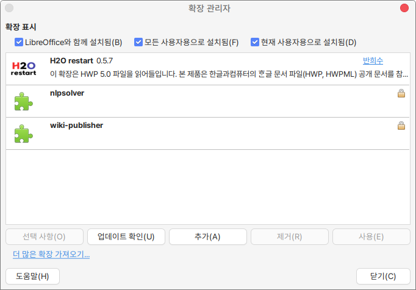

# hwp2odt

리브레오피스에서 한컴오피스의 한글파일을 LibreOffice에서 읽을 수 있는 확장 기능.



* 소스코드 : https://github.com/ebandal/H2Orestart
* 이 프로젝트는 원본 프로젝트의 바이너리를 데비안 패키지로 만들어 쉽게 설치할 수 있도록 만든 프로젝트입니다.

## Install from APT Repository
```
wget -qO- https://repo.hamonikr.org/hamonikr-app.apt | sudo -E bash -

sudo apt install libreoffice-hwp2odt
```

## Building debian package
```
dpkg-buildpackage -us -uc
```
