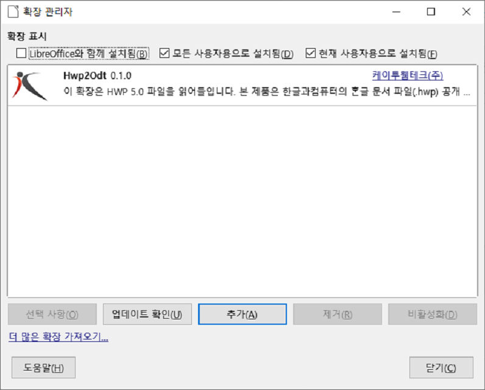

# hwp2odt

* 원본 프로젝트는 다음 주소(https://github.com/k2webtech/hwp2odt) 에서 확인 부탁드립니다.
* 다음 프로젝트는 원본 프로젝트의 바이너리를 데비안 패키지로 만들어 쉽게 설치할 수 있도록 만든 프로젝트입니다.


한컴오피스의 한글파일을 LibreOffice에서 읽을 수 있는 확장 바이너리입니다.
바이너리를 다운로드 받아서 LibreOffice를 실행시키고, "확장 관리자"에서 추가를 하면 됩니다.


확장을 추가한 후에는 

- 파일 열기창에서 "Hwp2002_Writer (*.hwp)" 파일 유형을 필터링하거나, 

- hwp파일을 끌어오기를 하여

hwp파일을  OpenDocumentText (ODT)형식으로 변환 할 수 있습니다.

저장은 ODT 형식으로만 저장할 수 있습니다.

* 확장 바이너리 사용은 무료이며, 편하게 사용하시면 됩니다. 
* 오류나 불편사항은 이 github (https://github.com/k2webtech/hwp2odt) 의 issue에 등록해주시면 주기적으로 개선하겠습니다.

## 알려진 이슈[Known Issue]
* Hwp2Odt v0.3.6 에서 리브레오피스 7.2 이상에서 변환품질이 저하되는 문제점 개선이 있었습니다. v0.3.6 이후 버전을 사용하시길 권합니다.

## extension
* 리브레오피스 extension 에는 major 버전만 배포합니다. https://extensions.libreoffice.org/en/extensions/show/5698

# Debian build & install

간단하게 데비안 패키지로 만들어서 설치된 리브레 오피스에 바로 적용시키는 방법입니다.  
최신버전 빌드시 debian 폴더 안에 있는 Hwp2Odt.oxt 바이너리 파일만 변경하면 됩니다.

## Build-Depends
```
debhelper
build-essential
```

## Build
```
dpkg-buildpackage -us -uc
```

## Focal
```
# curl 패키지가 필요할 수 있습니다. (sudo apt install curl)
curl -sL https://pkg.hamonikr.org/add-hamonikr.apt | sudo -E bash -
sudo apt install libreoffice-hwp2odt
```
